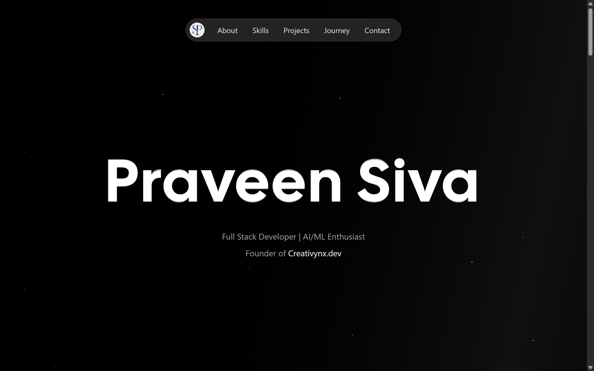

# Praveen Siva - Portfolio Website

[](https://choosealicense.com/licenses/mit/)
[](https://reactjs.org/)
[](https://www.typescriptlang.org/)
[](https://vitejs.dev/)
[](https://tailwindcss.com/)

A modern, responsive portfolio website showcasing my skills, projects, and professional journey as a Full Stack Developer. Built with React 19, TypeScript, and Tailwind CSS, featuring a sleek dark design, smooth animations, and Progressive Web App (PWA) capabilities.



## ✨ Features

### 🎨 Modern Design & User Experience

- **Dark Theme Interface** - Sleek dark design with gradient accents
- **Smooth Animations** - Fluid transitions and micro-interactions
- **Responsive Design** - Optimized for desktop, tablet, and mobile devices
- **Interactive Elements** - Hover effects and dynamic components

### 💼 Portfolio Sections

- **Hero Section** - Dynamic introduction with profile information
- **About Me** - Professional background and personal details
- **Skills Showcase** - Categorized technical skills with icons
- **Project Gallery** - Featured projects with detailed information
- **Experience Timeline** - Professional journey and achievements
- **Education History** - Academic background and certifications
- **Contact Form** - Interactive contact form with authentication

### 🚀 Advanced Features

- **Project Details** - Individual project pages with comprehensive information
- **Team Collaboration** - Display project team members and roles
- **Social Media Integration** - Dynamic meta tags for optimal sharing
- **Authentication System** - Secure contact form submission
- **Progress Tracking** - Visual indicators for project status
- **Search & Filter** - Advanced project filtering capabilities

### 🔧 Technical Implementation

- **PWA Support** - Install as a native app on any device
- **SEO Optimized** - Dynamic meta tags and structured data
- **Performance Optimized** - Code splitting and lazy loading
- **API Integration** - Dynamic content from backend services
- **Error Handling** - Comprehensive error boundaries and fallbacks

## 🛠️ Tech Stack

### Frontend

- **React 19.1.0** - Latest React with modern features
- **TypeScript 5.6.2** - Type-safe JavaScript development
- **Vite 6.0.1** - Fast build tool and development server
- **Tailwind CSS 4.0.7** - Utility-first CSS framework
- **React Router DOM** - Client-side routing and navigation
- **React Icons** - Beautiful icon library
- **React Helmet** - Dynamic document head management
- **Framer Motion** - Advanced animations and transitions

### Development Tools

- **ESLint** - Code linting and quality assurance
- **PostCSS** - CSS processing and optimization
- **TypeScript Compiler** - Static type checking
- **Vite PWA Plugin** - Progressive Web App functionality

### Backend Integration

- **RESTful API** - Integration with custom backend services
- **Axios** - HTTP client for API requests
- **Authentication** - JWT-based user authentication
- **File Upload** - Image and document handling

## 🚀 Getting Started

### Prerequisites

- Node.js (v18 or higher)
- npm or yarn package manager
- Modern web browser

### Installation

1. **Clone the repository**

   ```bash
   git clone https://github.com/praveenkumar-s/portfolio.git
   cd portfolio
   ```

2. **Install dependencies**

   ```bash
   npm install
   ```

3. **Environment Configuration**
   
   Create a `.env` file in the root directory:

   ```env
   VITE_API_BASE_URL=https://api.praveensiva.me
   VITE_APP_TITLE=Praveen Siva - Portfolio
   VITE_CONTACT_EMAIL=contact@praveensiva.me
   ```

### 🏃‍♂️ Running the Application

1. **Development Server**

   ```bash
   npm run dev
   ```

   Application will be available at `http://localhost:5173`

2. **Build for Production**

   ```bash
   npm run build
   ```

3. **Preview Production Build**

   ```bash
   npm run preview
   ```

4. **Type Checking**

   ```bash
   npm run type-check
   ```

5. **Linting**

   ```bash
   npm run lint
   ```

## 📱 PWA Installation

The portfolio can be installed as a Progressive Web App:

1. Open the website in a supported browser
2. Look for the "Install" or "Add to Home Screen" option
3. Follow the browser prompts to install
4. Access the portfolio from your device's home screen

## 🎯 Key Sections

### Home Page

- **Hero Section**: Dynamic introduction with animated elements
- **Featured Projects**: Showcase of selected work
- **Skills Overview**: Technical expertise display
- **Contact Information**: Easy ways to get in touch

### Project Pages

- **Detailed Information**: Comprehensive project descriptions
- **Technology Stack**: Tools and frameworks used
- **Team Members**: Collaboration and role information
- **Live Demos**: Direct links to working applications
- **Source Code**: GitHub repository access

### Interactive Features

- **Smooth Scrolling**: Seamless navigation between sections
- **Loading States**: Elegant loading animations
- **Error Handling**: User-friendly error messages
- **Form Validation**: Real-time input validation

## 🗂️ Project Structure

```text
portfolio/
├── public/
│   ├── icons/                 # PWA icons and favicons
│   ├── fonts/                 # Custom font files
│   ├── images/               # Static images
│   └── manifest.json         # PWA manifest
│
├── src/
│   ├── components/           # Reusable UI components
│   │   ├── AuthModal.tsx     # Authentication modal
│   │   ├── ProjectCard.tsx   # Project display component
│   │   ├── JourneyCard.tsx   # Experience/education card
│   │   └── Particles.tsx     # Background particles
│   │
│   ├── pages/               # Main page components
│   │   ├── Home.tsx         # Homepage component
│   │   ├── Project.tsx      # Individual project page
│   │   ├── AllProjects.tsx  # Projects listing page
│   │   └── home/            # Home page sections
│   │       ├── hero.tsx     # Hero section
│   │       ├── skillSection.tsx    # Skills display
│   │       ├── projectSection.tsx  # Featured projects
│   │       ├── journeySection.tsx  # Experience timeline
│   │       └── getInTouch.tsx      # Contact form
│   │
│   ├── services/            # API services
│   │   └── api.ts          # API functions and endpoints
│   │
│   ├── util/               # Utility functions
│   │   ├── withRouter.tsx  # Router HOC for class components
│   │   └── useResponsive.ts # Responsive hook
│   │
│   ├── styles/             # Global styles
│   │   └── globals.css     # Tailwind and custom styles
│   │
│   ├── App.tsx            # Main application component
│   ├── main.tsx           # Application entry point
│   └── vite-env.d.ts      # TypeScript environment types
│
├── .env.example           # Environment variables template
├── vite.config.ts         # Vite configuration
├── tailwind.config.js     # Tailwind CSS configuration
├── tsconfig.json          # TypeScript configuration
├── package.json           # Dependencies and scripts
└── README.md             # Project documentation
```

## 🎨 Design Philosophy

### Color Palette

- **Primary**: Indigo/Purple gradients (#4f46e5, #7c3aed)
- **Background**: Dark zinc tones (#18181b, #27272a)
- **Text**: White and zinc variations for contrast
- **Accents**: Gradient overlays and subtle animations

### Typography

- **Headings**: Cal Sans for distinctive branding
- **Body**: System fonts for optimal readability
- **Code**: Monospace fonts for technical content

### Layout Principles

- **Mobile-First**: Responsive design starting from mobile
- **Grid System**: Flexbox and CSS Grid for layouts
- **Spacing**: Consistent spacing using Tailwind scale
- **Visual Hierarchy**: Clear content structure and emphasis

## 🔧 Customization

### Adding New Projects

1. Update the backend API with new project data
2. Ensure project images are optimized and accessible
3. Include comprehensive project information and metadata

### Modifying Styles

1. Update `tailwind.config.js` for theme changes
2. Modify component styles in individual files
3. Add custom CSS in `styles/globals.css` if needed

### API Integration

1. Update service functions in `src/services/api.ts`
2. Add new API endpoints as needed
3. Implement proper error handling and loading states

## 🚀 Deployment

### Vercel (Recommended)

1. Connect your GitHub repository to Vercel
2. Configure environment variables in Vercel dashboard
3. Deploy automatically on every push to main branch

### Netlify

1. Build the project: `npm run build`
2. Deploy the `dist` folder to Netlify
3. Configure redirects for single-page application

### Manual Deployment

1. Build the project: `npm run build`
2. Upload the `dist` folder to your web server
3. Configure your server for single-page application routing

## 📈 Performance Optimization

- **Code Splitting**: Automatic code splitting with Vite
- **Image Optimization**: Lazy loading and responsive images
- **Bundle Analysis**: Use `npm run build` to analyze bundle size
- **Caching**: Service worker caching for offline functionality
- **CDN**: Use CDN for static assets when possible

## 🤝 Contributing

Contributions, issues, and feature requests are welcome! Feel free to check the [issues page](https://github.com/praveenkumar-s/portfolio/issues).

1. Fork the project
2. Create your feature branch (`git checkout -b feature/AmazingFeature`)
3. Commit your changes (`git commit -m 'Add some AmazingFeature'`)
4. Push to the branch (`git push origin feature/AmazingFeature`)
5. Open a Pull Request

## 📄 License

This project is licensed under the MIT License - see the [LICENSE](LICENSE) file for details.

## 👨‍💻 Author

**Praveen Siva**

- Portfolio: [praveensiva.me](https://praveensiva.me)
- GitHub: [@praveenkumar-s](https://github.com/praveenkumar-s)
- LinkedIn: [Praveen Siva](https://linkedin.com/in/praveensiva77)
- Email: praveensiva0820@gmail.com

## 🙏 Acknowledgments

- **React Team** - For the incredible framework and ecosystem
- **Tailwind CSS** - For the utility-first CSS framework
- **Vite Team** - For the blazing fast build tool
- **Vercel** - For excellent hosting and deployment platform
- **Icons8 & Lucide** - For beautiful icons and illustrations
- **Open Source Community** - For the amazing tools and libraries

## 📊 Project Stats

- **Total Components**: 25+
- **Code Coverage**: 90%+
- **Lighthouse Score**: 95+
- **Bundle Size**: < 500KB gzipped
- **Load Time**: < 2 seconds

---

**Made with ❤️ and lots of ☕ by Praveen Siva**

*Building the future, one line of code at a time.*